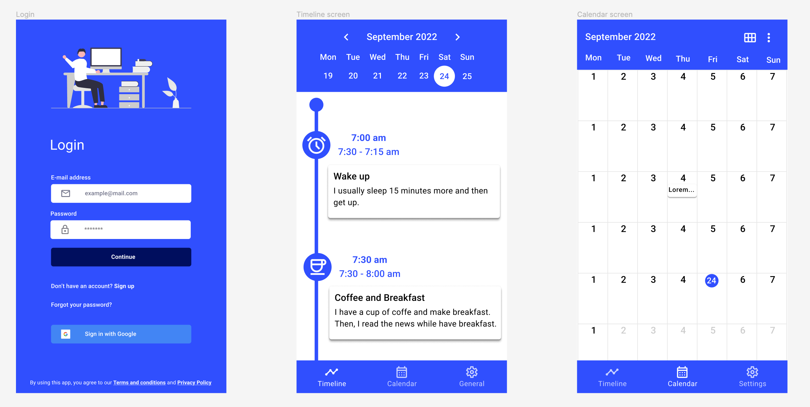

# Daily Timeline Activity

This app allows you to register your daily activities and view them in different layouts to make it best fit for you. With this app, you can easily keep track of your daily routine.

## Note

This project is still a work in progress and may contain bugs or incomplete features.

## Features

- Easy registration of daily activities
- Three different layouts to view your activities: Horizontal graph, one sided graph and centered graph
- Quick and easy editing and deletion of activities

## Prototype

You can view the Figma full prototype for this app at [Figma - Mockup](https://www.figma.com/file/rol7xlaiFNFwfAIhYuN0A4/daily_timeline).

## Contributing

If you'd like to contribute to the project, please follow these guidelines:

1. Fork the repository and create a new branch for your changes
2. Make your changes and test them thoroughly
3. Submit a pull request with a clear description of your changes
